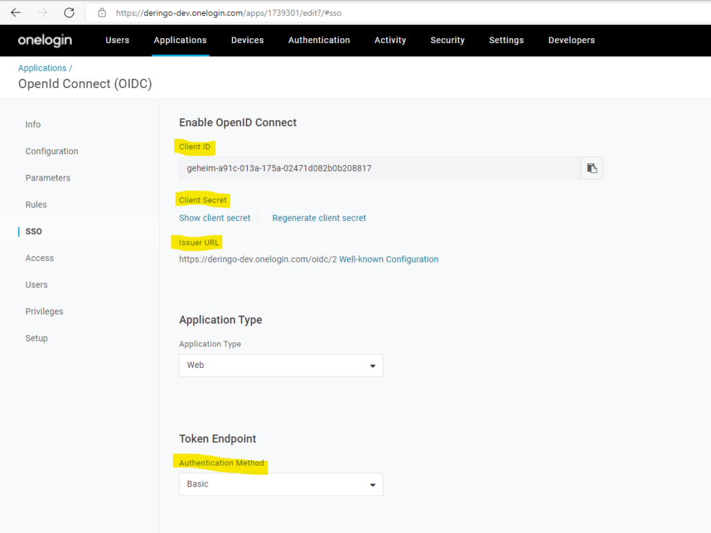

# DockerOneLoginApacheSample
Sample App for a Apache based Reverse Proxy with OneLogin for authentication TBD: and authorization

## Version 4
Three networks:
* Internet
    + User
    + OneLogin
* DMZ
    + Load Balancer
    + 2 Reverse Proxy
    + 2 Public Server
* Intern
    + ShowHeaders
    + 2 Private Servers
    + User Server
    + Admin Server

An unauthenticated user has access to RPs and public server through the Load Balancer. 
Only authenticated users have access to Intern servers. 
TBD: For User Server the user needs to have the user role. 
TBD: For Admin Server the user needs to have the admin role. 

### Configuration - in and from OneLogin
In OneLogin Administrative page for your app collect this information:
* Client ID
* Client Secret
* Issuer URL

In Configuration page add Redirect URI:
* http://localhost/private/redirect_uri

Enable Self Registration: Users -> Self registration

### Configuration
Open reverseproxy/conf/reverseproxy.conf and enter the configuration from OneLogin.
Open public/public_html/index.html and edit registration link.

### Start
Bevor the first start the public network needs to be created: 
``docker network create public_network``  
 
``docker-compose up``

### Test
Open ``http://localhost`` in your browser.
You will find a simple page with four links:
*  ``http://localhost/public``
*  ``http://localhost/private``
*  ``http://localhost/index``
*  ``http://localhost/showheaders``
*  ``http://localhost/user``
*  ``http://localhost/admin``

Open ``http://localhost/public`` and you will see the public page. 
Open ``http://localhost/private`` and you will see the private page... NOT! Instead you'll should see a OneLogin login page and only after login you will see the private page. 
Open ``http://localhost/index`` and you will see the <i>Start</i> page. 
Open ``http://localhost/showheaders`` and you will see the ShowHeades page (if you are logged in). This page shows all Headers. 
Open ``http://localhost/user`` and you will see the User page, if you are logged in with role <i>user</i>. TBD 
Open ``http://localhost/admin`` and you will see the Admin page, if you are logged in with role <i>admin</i>. TBD 
