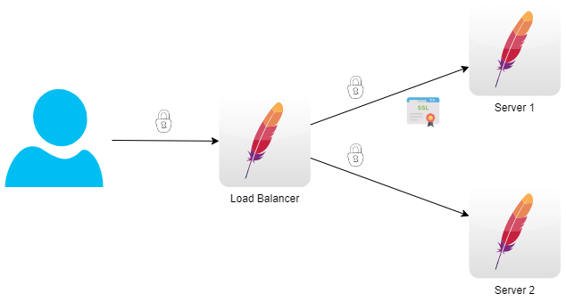

# DockerOneLoginApacheSample
Sample App for a Apache based Reverse Proxy with OneLogin for authentication.

## Version 8
LoadBalancer with mutual SSL to two backend servers. 
Server 1 is protected through mutual SSL. 
Server 2 is not protected.

### Configuration
No configuration required, just start: ``docker-compose up``

### Test
Open ``http://localhost`` in your browser. Must redirect to ``https://localhost``. 
Open ``https://localhost`` and reload several times. You must see Public Page from server 1 and server 2 alternate. 
Open ``https://localhost:8091`` and you must see an error message from server 1. 
Open ``https://localhost:8092`` and you can see Public Page from server 2. 