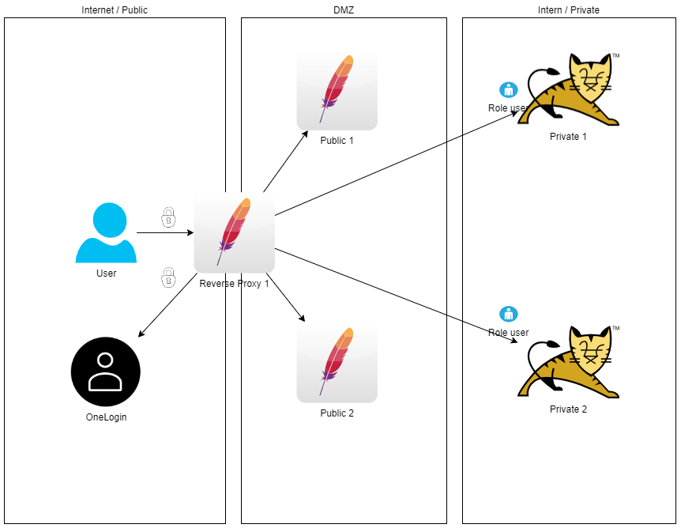
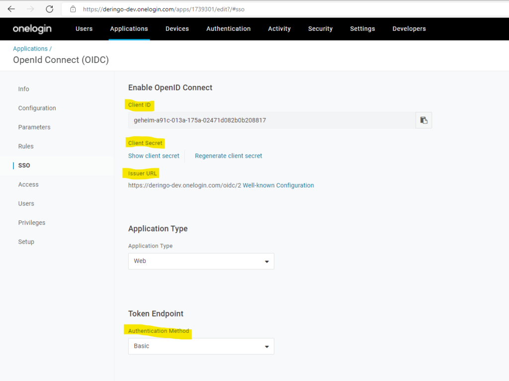

# DockerOneLoginApacheSample
Sample App for a Apache based Reverse Proxy with OneLogin for authentication TBD: and authorization 
UPDATE: The authorization can not be done this way, because OneLogin does not provide application roles.

## Version 9
Three networks:
* Internet
    + User
    + OneLogin
* DMZ
    + Reverse Proxy
    + 2 Public Server
* Intern
    + 2 Private Servers

An unauthenticated user has access to public servers through the Reverse Proxy. 
Only authenticated users have access to private servers. 
Only authenticated users with role 'user' have access application on private servers. 

## Version 9 - API
There is also an example for API calls in project oneloginjavaappsample -> Class TestMain.java 

## Configuration
### in and from OneLogin
In OneLogin Administrative page for your app collect this information:
* Client ID
* Client Secret
* Issuer URL

In Configuration page add Redirect URI:
* http://<YOUR-IP\>/private/redirect_uri

Enable Self Registration: Users -> Self registration

In OneLogin Developers -> API Credentials page create API Access with 'Manage all' for your app and collect this information:
* API Client ID
* API Client Secret

### Configuration
Open reverseproxy/conf/reverseproxy-ssl.conf and enter the configuration from OneLogin. 
Open public/public_html/index.html and edit registration link. 
Open oneloginjavaappsample/conf/server.properties and edit anything, if required. 
 
For API-Example: Open oneloginjavaappsample/src/resources/application.properties and enter the API configuration from OneLogin. 

### Start
Bevor the first start the public network needs to be created: 
``docker network create public_network``  
 
``docker-compose up``

### Test
Open ``https://<YOUR-IP>`` in your browser. 
You can see the public pages. 
Click on Login to access private pages. You have to login to OneLogin first. 
Click on Registration to test Self Registration for your application.